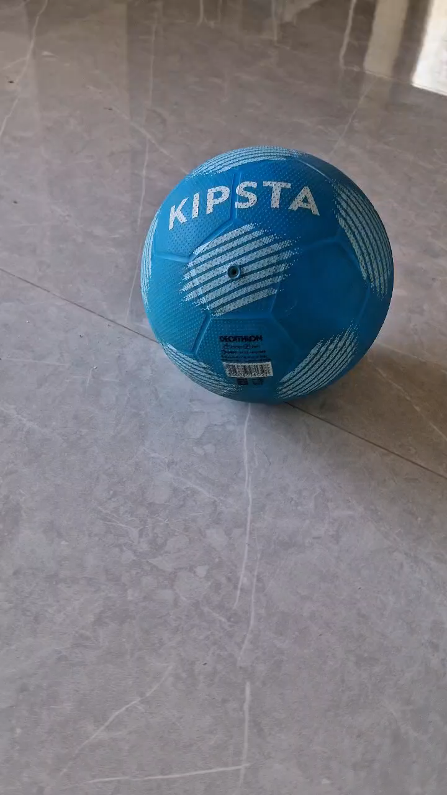
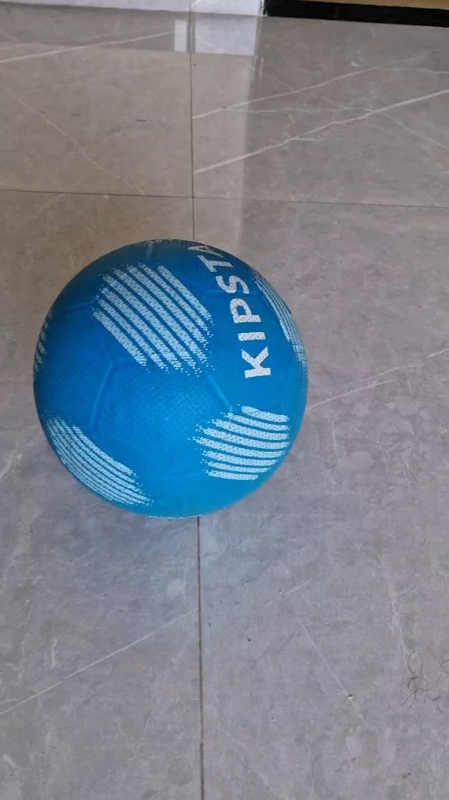
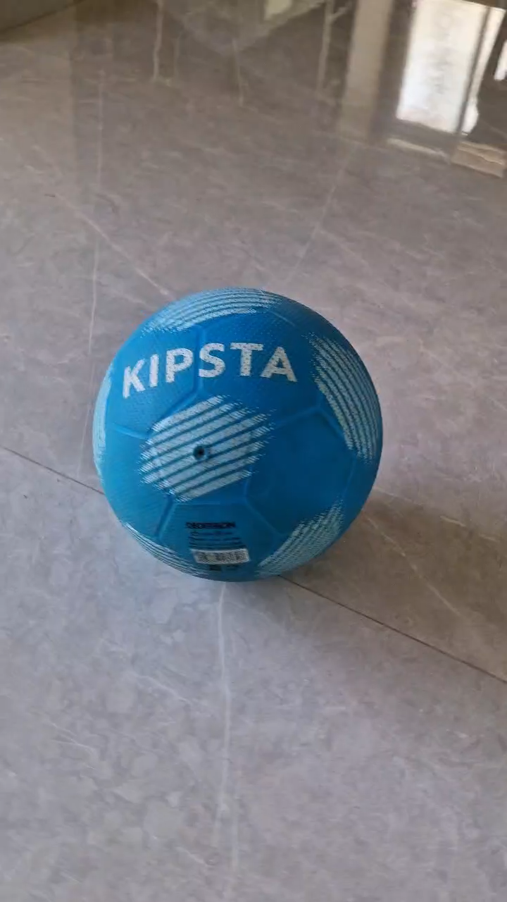
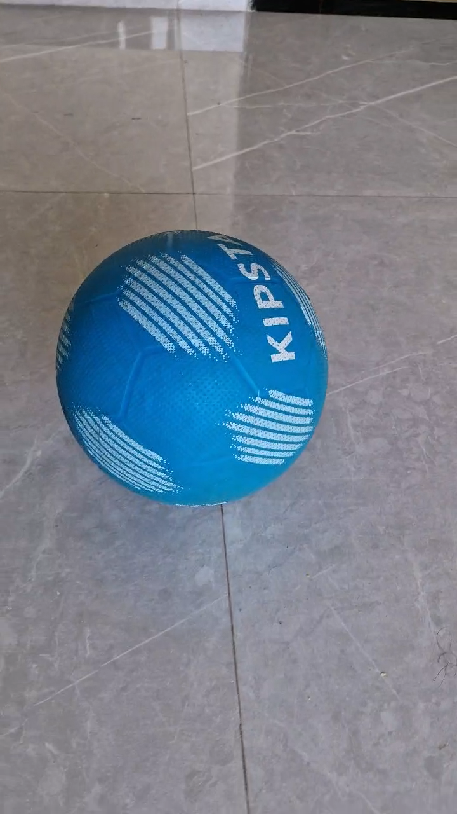
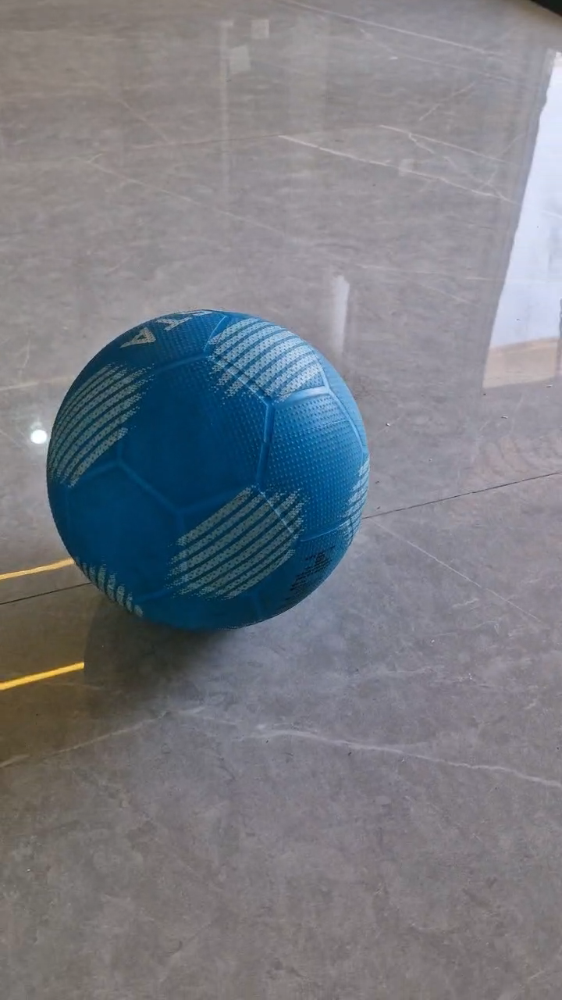
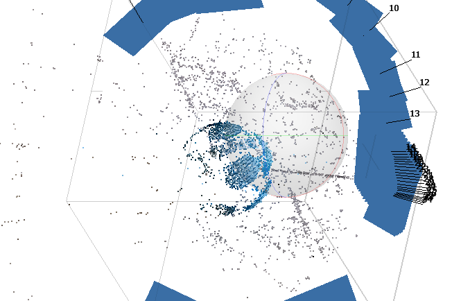
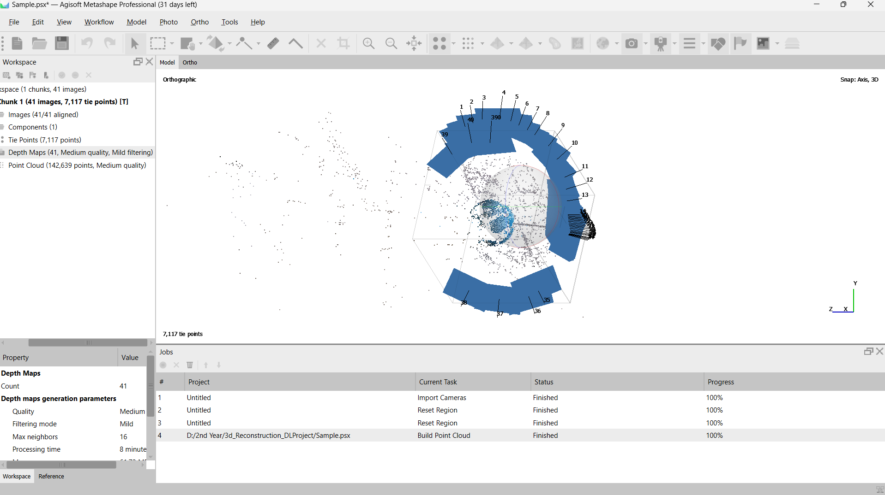
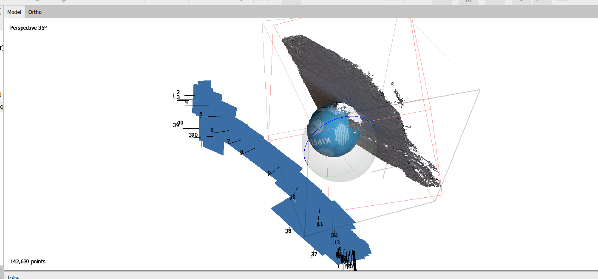
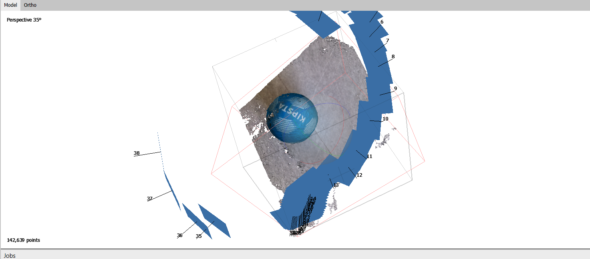

# 3D Reconstruction using Neural Radiance Fields (NeRF)

## Overview
This project implements a cutting-edge 3D reconstruction pipeline that combines Neural Radiance Fields (NeRF) for neural volumetric rendering with Agisoft Metashape’s photogrammetry tools. The system creates highly detailed and photorealistic 3D scenes from 2D images, enabling novel viewpoint rendering and precise texture mapping.

## Features
- Continuous volumetric scene modeling using NeRF  
- Camera pose estimation using COLMAP  
- Sparse and dense point cloud generation with Agisoft Metashape  
- 3D mesh reconstruction and texture mapping  
- Python scripting for data preprocessing, training, and rendering  
- Optimization techniques to enhance 3D model fidelity

 Setup Agisoft Metashape and COLMAP as per their official instructions.
## Steps we implemented
1) We have taken a video of a ball.
2) Then we have extracted the frames from the video which is basically the ball from all sides or every point of view.
   
             

3) Generate a detailed cloud that accurately represents scene geometry in the Agisoft MetaShape
4) Create a 3D surface mesh and apply realistic textures from source images.

## Usage
- Prepare images with known camera poses or run COLMAP for pose estimation.  
- Train NeRF model on posed images using provided scripts.  
- Render novel views and generate 3D mesh with texture mapping in Metashape.  

**3D Reconstruction using NeRF (Neural Radiance Fields)** is an advanced method in computer vision for generating highly detailed 3D scenes from a set of 2D images. NeRF uses a neural network to model the scene as a continuous volumetric field, enabling photo-realistic rendering of complex environments from novel viewpoints.

---

### 🔍 What is NeRF?

**NeRF (Neural Radiance Fields)** is a neural network that:

* Takes as input: camera pose + 2D images
* Learns a function that maps 3D coordinates (x, y, z) and viewing direction (θ, φ) → to color (RGB) and density (σ)
* Uses **volume rendering** to render 2D images from 3D scenes

---

### 📌 How NeRF Works: Step-by-Step

1. **Input Data**:

   * A set of posed 2D images of a scene (image + camera intrinsics & extrinsics).

2. **Positional Encoding**:

   * The 3D coordinates and viewing direction are encoded to help the network learn high-frequency details.

3. **Neural Network**:

   * A multilayer perceptron (MLP) learns to predict color and density for any 3D point in space.

4. **Volume Rendering**:

   * The network samples many points along rays cast from the camera into the scene.
   * It computes color by integrating the predicted densities and colors along each ray.
   * This produces a final image from a novel viewpoint.

5. **Training**:

   * The network is trained by minimizing the difference between rendered images and real images using a loss function (usually MSE).

6. **Rendering**:

   * Once trained, NeRF can generate new views from any camera pose by querying the network.

---

### 📦 Tools & Frameworks

Here are some popular implementations and tools you can use:

| Tool/Repo                                                          | Description                                                                           |
| ------------------------------------------------------------------ | ------------------------------------------------------------------------------------- |
| **[Original NeRF](https://github.com/bmild/nerf)**                 | Official PyTorch implementation by authors                                            |
| **[Instant-NGP](https://github.com/NVlabs/instant-ngp)**           | Real-time NeRF with GPU acceleration by NVIDIA                                        |
| **[nerfstudio](https://github.com/nerfstudio-project/nerfstudio)** | Beginner-friendly and modular NeRF library                                            |
| **[Plenoxels](https://github.com/sxyu/svox2)**                     | Faster NeRF-like models using sparse voxel grids                                      |
| **COLMAP**                                                         | Photogrammetry tool used for camera pose estimation (often used before NeRF training) |

---

### ✅ Applications of NeRF

* **3D scene reconstruction**
* **Virtual reality / Augmented reality**
* **Cinematic visual effects**
* **Cultural heritage preservation**
* **Robotics / SLAM (Simultaneous Localization and Mapping)**

---

### ⚙️ System Requirements

To train and render NeRFs efficiently, you generally need:

* A modern **GPU (NVIDIA recommended)**
* **CUDA + cuDNN** installed
* Python 3.x environment with libraries: `PyTorch`, `NumPy`, `imageio`, `matplotlib`, etc.

---

### 🧪 Example Pipeline

Here's a high-level overview if you want to try 3D reconstruction using NeRF on your own:

1. **Capture Data**: Take multiple photos around an object or scene with known or estimated camera poses.
2. **Estimate Camera Poses**: Use COLMAP to estimate poses.
3. **Preprocess Images**: Resize and align images if needed.
4. **Train NeRF**: Use an implementation like `instant-ngp` or `nerfstudio`.
5. **Render Novel Views**: Generate videos or images from new angles.

---

### 🚀 Want a Hands-On Demo?

I can guide you to:

* Install and run NeRF on your local system
* Train on a custom or example dataset
* Render your own 3D scene from multiple views

Let me know:

* Do you have a GPU?
* Do you want to run locally or on Google Colab?
* Are you okay with CLI or prefer GUI-based tools?

Would you like a **step-by-step tutorial** using a specific tool (like `nerfstudio` or `instant-ngp`)?

## Technologies Used
- PyTorch for neural radiance field modeling  
- Agisoft Metashape for photogrammetry and mesh reconstruction  
- COLMAP for camera pose estimation  
- Python for scripting and data processing  

## Applications
- Virtual reality scene generation  
- Cultural heritage preservation  
- Robotics and environment mapping

## Contribution
Contributions are welcome! Please submit issues or pull requests.

